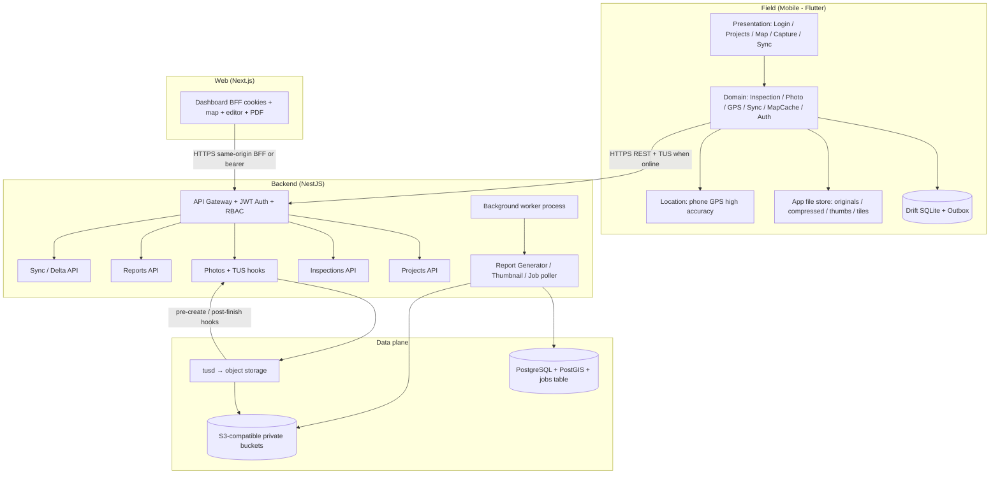
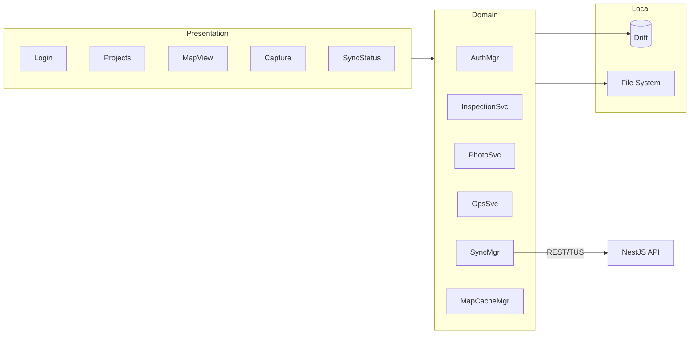
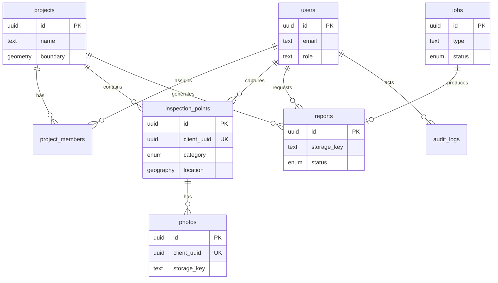
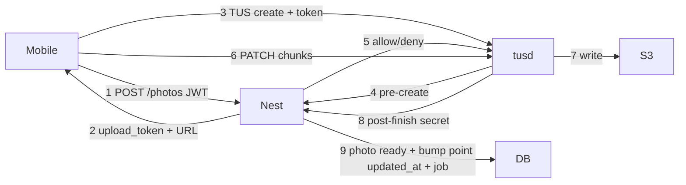

# FlahaINSPECT — Technical Design Document

| Field | Value |
|-------|--------|
| **Document title** | FlahaINSPECT Technical Design (MVP) |
| **Product** | **FlahaINSPECT** (legacy docs may spell FlahaINSPCT; public name and package IDs use **FlahaINSPECT**) |
| **Author** | Flaha Engineering (placeholder) |
| **Date** | 2026-08-17 |
| **Status** | **Design freeze (pre-PR-01)** — implement from this document + [`ROADMAP.md`](./ROADMAP.md) |
| **Companion docs** | [`ROADMAP.md`](./ROADMAP.md) (phases/releases), [`GAPS.md`](./GAPS.md) (residual register), [`../CHANGELOG.md`](../CHANGELOG.md), [`Wireframes/`](./Wireframes/) (UX of record) |
| **Audience** | Senior engineers implementing from a greenfield monorepo |
| **Bundle / package IDs** | Mobile: `com.flaha.inspect`; API title: `FlahaINSPECT API`; npm scope: `@flaha/inspect-*` |
| **Source docs** | Satellite notes (non-normative): `Docs/FlahaINSPECT - OverView.md`, `Docs/FlahaINSPECT - System Schematics.md`, `Docs/FlahaINSPECT - Offline sync.md`, `Docs/FlahaINSPECT - Resumable photo uploads.md`, `Docs/FlahaINSPECT - Offline map tile caching.md`, `Docs/FlahaINSPECT - External GNSS receivers.md`. UX of record: `Docs/Wireframes/`. `Docs/Photo/` mockups are mood only. |

---

## Overview

FlahaINSPECT is an offline-first field inspection platform for Flaha Agri Tech’s landscape, farm, irrigation, and softscape maintenance work in Qatar. Field inspectors capture geotagged photos with a single category (**Defect** / **Normal** / **Note**), optional free-text notes, and GPS accuracy metadata. Data is stored locally first, then synced when connectivity returns. Managers use a web dashboard to review color-coded maps, edit remarks/procedures/status, and export client-ready PDF reports.

This document formalizes the **locked MVP scope**, **system architecture**, **Postgres + Drift schemas**, **REST/TUS API contracts**, **offline sync**, **photo and map strategies**, **security**, **observability**, **rollout**, and an ordered **PR plan** sufficient to implement without re-deriving product decisions from the exploratory docs.

**Core field loop (product of record):**  
Login → Select project → High-accuracy GPS → Photo + Defect/Normal/Note → Save offline → Sync later → Dashboard edit → PDF report.

**Staffing / timeline assumption:** Full MVP surface (mobile + API + web + TUS + offline maps + PDF) is **~10–14 weeks for 2–3 engineers**, or a **slim pilot in 6–8 weeks** (capture + push sync + basic dashboard map/list + simple PDF without offline map polish). Overview’s “6–10 weeks” maps to the slim pilot; PR plan lists the full surface with effort notes.

---

## Background & Motivation

### Current state

Today, site rounds often produce scattered photos (WhatsApp, camera roll) without reliable location, incomplete notes, weak audit trails, and slow client reporting. Existing commercial tools (Survey123, SiteCam, etc.) prove the pattern; Flaha needs a tightly scoped product aligned to three categories, offline Qatar field conditions, and in-house report quality as a service differentiator.

### Pain points this design addresses

| Pain | Design response |
|------|-----------------|
| No connectivity on farms / large sites | Offline-first local DB + file store + durable outbox |
| Large photos fail on flaky cellular | TUS resumable uploads, metadata-first sync |
| Unusable maps offline | Project-bounded tile cache + local vector overlays |
| GPS uncertainty | Always store accuracy; UI soft-warn &gt;10 m; pin adjust **before** first save; GNSS deferred |
| Reporting friction | Server PDF with map snapshot + categorized photo grid |
| Unclear post-capture workflow | Dashboard editor for remarks / procedure / status |

### Current repository state

`FlahaINSPECT` is **docs-only**. There is no application source yet. Implementation starts from this design as the contract for schema, API, and PR sequencing.

### Intentional drifts from exploratory docs

| Topic | Doc note | This design | Why |
|-------|----------|-------------|-----|
| Photo vs metadata order | TUS paper suggests photo-first linking | **Metadata-first** then TUS | Matches Offline sync doc; points appear on dashboard before large uploads finish |
| Arabic day-one | Overview improvement #9 | EN primary; AR scaffolding PR-17 | Pilot risk accepted; critical strings can ship EN-only |
| Client comments | Schematics “read + comments” | **Comments deferred**; client role post-MVP | Security + scope |
| Timeline | Overview 6–10 weeks | Slim pilot 6–8 w / full 10–14 w | Honest vs 17-PR breadth |
| Server originals / EXIF | Overview: keep camera originals + GPS EXIF | **Operational evidence only (KD-36):** 1920px JPEG, GPS EXIF stripped; no forensic master on server | See Photo evidence decision |
| Tile source | Maps paper: OSM or Mapbox/vector freely | **Dev OSM only; pilot/prod contracted or self-hosted (KD-35)** | OSM bulk pre-cache ToS |
| Dual role columns | Schematics: per-project + global | **`users.role` authorizes; membership is assignment only (KD-33)** | Stops FORBIDDEN drift |

---

## Goals & Non-Goals

### Goals (MVP ships)

1. **Mobile offline capture** (Flutter): login, project list, map with live location, capture (**exactly one required photo** + category + note + GPS meta), local list + sync status, manual “Sync now”.
2. **Durable sync**: outbox pattern; client UUIDs; metadata before photos; retries with backoff; TUS for photos.
3. **Backend API** (NestJS): auth, projects, inspection points, photos (TUS), reports, delta pull for assigned projects.
4. **Postgres + PostGIS**: spatial points, optional project boundary polygons, indexes for map queries.
5. **Object storage**: upload candidates, thumbnails, generated PDFs (S3-compatible).
6. **Web dashboard** (Next.js): project overview, interactive map (Leaflet), point detail editor, PDF export (**manager only**).
7. **Roles**: `inspector` | `manager` (client role **schema-ready, no login UX in pilot** — see KD-22).
8. **Bilingual shell readiness**: English primary; Arabic keys/RTL in PR-17 (not blocking pilot).
9. **Field UX**: large category buttons, accuracy display + soft warn, high-contrast capture UI (per mockups).

### Non-goals / deferred (explicitly out of MVP)

| Item | Rationale |
|------|-----------|
| External Bluetooth GNSS / NMEA / RTK | Optional upgrade; phone GPS + accuracy meta is enough for MVP |
| AI classification of defects | Later phase |
| Path / track recording of entire round | v1.1+ |
| Heatmaps, advanced spatial analytics | Needs volume + PostGIS maturity |
| Rich sub-types / severity / voice notes / compass required | Keep form short; free-text note only |
| Client self-serve portal / comments / client PDF generate | Post-MVP; confidential site photos |
| Real-time multi-user collab / CRDTs | Low-conflict append-heavy workflow |
| Excel / GeoJSON exports | PDF first |
| Continuous high-power track logging | Battery risk |
| Full packaged MBTiles server pipeline | MVP uses FMTC region download + ambient cache |
| Field edit of points after save (outbox update) | Create-once; pin adjust only pre-save |
| Multiple photos per point | Exactly one required photo (schema remains 1:N for later) |
| Redis / BullMQ | Durable SQL job table + worker process instead |

---

## Locked MVP Scope

### In scope (must ship)

| Area | MVP capability |
|------|----------------|
| Auth | Email/password login; JWT access 15m + refresh **7d** with rotation/reuse detection; manager sets password for pilot; `min_app_version` on `/auth/me` |
| Projects | CRUD (manager); list assigned (inspector); optional boundary GeoJSON; soft-delete/archive; server-maintained bbox |
| Capture | Camera; **one required photo**; category; free-text note; lat/lon; accuracy_m; pin adjust **before** Save; client UUID |
| Offline | Drift SQLite + filesystem photos; outbox (`CreateInspectionPoint`, `UploadPhoto` only); queue UI |
| Sync | Push points (idempotent); TUS photos; keyset delta pull; status per item |
| Photos | Compress upload candidate (max edge 1920px, JPEG ~80%); **strip GPS EXIF**; server thumbnail; TUS security architecture |
| Maps mobile | OSM-compatible tiles + attribution (dev default); project pre-cache; local markers/boundary |
| Maps web | Leaflet; red/green/yellow markers; filters; boundary |
| Dashboard edit | **remarks**, **recommended_procedure**, **status** only (field `note` read-only on web) |
| Reports | Manager generates async PDF (Puppeteer); stream thumbs; cap **200 points** per report |
| i18n | EN primary; AR resource keys later |

### Out of scope (see Non-goals)

External GNSS, AI, path tracking, heatmaps, rich taxonomies, client login/PDF generate, multi-photo capture UX, Redis.

### Success metrics

**Slim pilot (capture → sync → dashboard edit; no PDF/offline-map polish required):**

- ≥95% of captures eventually sync without manual re-entry  
- Median time-to-sync (metadata) &lt; 30s on cellular after reconnect  
- Photo resume works after app kill mid-upload  
- Field capture of one point (photo + category) &lt; 15s once GPS fix acquired  

**Full MVP only (requires PR-09/15):**

- Manager can produce PDF for a project in &lt; 2 minutes after sync complete (≤100 points)

---

## Proposed Design

### High-level architecture



### Stack lock (MVP)

| Layer | Choice | Justification |
|-------|--------|---------------|
| Mobile | **Flutter** (`com.flaha.inspect`) | Strong camera/GPS/offline libs; matches schematics |
| Local DB | **Drift (SQLite)** + filesystem | Typed schema, migrations, outbox |
| Photo upload | **TUS** (`tusc` + persistent store) | Resume on flaky networks |
| Maps mobile | **flutter_map + FMTC** | Region download; no Mapbox cost; MapLibre is alternative (see Alternatives) |
| Backend | **NestJS (Node)** | Sync, TUS hooks, PDF jobs, PostGIS |
| ORM / SQL | **Drizzle ORM + raw SQL migrations** for PostGIS | Geography/GIST without Prisma Unsupported-type friction (**KD-16**) |
| Database | **PostgreSQL 16 + PostGIS 3.x** | Spatial points/boundaries |
| Storage | **S3-compatible** MinIO (local) / S3 (prod); **private buckets only** | tusd integration |
| TUS server | **tusd** + Nest **pre-create** + **post-finish** hooks | AuthZ + finalize |
| Async jobs | **Durable `jobs` table + separate worker process** (no Redis MVP) | Survives API restart (**KD-17**) |
| Web | **Next.js (App Router) + React + Tailwind + Leaflet** | Dashboard |
| Web auth | **HttpOnly secure cookies via Next.js BFF** (API issues tokens; web sets cookies); mobile uses **Bearer** in secure storage | XSS-resistant web (**KD-18**) |
| Auth tokens | JWT access **15m** + refresh **7d**, rotation + reuse detection | Reduced stolen-device blast radius |
| Password hash | **argon2id** | Modern default (**KD-19**) |
| PDF | **Puppeteer** (HTML template + map screenshot) | Map fidelity for categorized points (**KD-20**); locked in PR-09 |
| Monorepo | **pnpm + Turborepo** for `apps/api`, `apps/web`, `packages/*` only; **Flutter is a sibling app** with own toolchain/CI (optional Melos later) | Don’t pretend Turborepo builds Flutter |

**Why NestJS over Supabase for MVP:** PostGIS-heavy queries, custom delta contracts, TUS completion → DB linking, and PDF generation are cleaner as Nest modules with explicit migrations.

### Monorepo layout (target)

```text
FlahaINSPECT/
  apps/
    api/                 # NestJS (HTTP)
    worker/              # NestJS or plain Node job poller (reports, thumbnails, GC)
    web/                 # Next.js
    mobile/              # Flutter (NOT in pnpm workspace packages)
  packages/
    api-client/          # OpenAPI-generated TS client (web) — regenerate each API PR
    shared-types/        # optional
  infra/
    docker-compose.yml   # Postgres+PostGIS, MinIO (private), tusd, api, worker
    tusd/
  docs/
  openapi/
    flaha-inspect-v1.yaml
  Makefile               # api/web/mobile targets; mobile via flutter CLI
```

**CI:** API + web + docker smoke from PR-01/PR-02; mobile job separate (`flutter test` / analyze). Turborepo pipelines cover Node packages only.

### Mobile architecture



**Capture path (always offline-safe):**

1. Acquire location (high accuracy; timeout e.g. 15s).
2. **Soft warn** if `accuracy_m > 10` (user may still save). Show accuracy on capture UI.
3. Optional **pin adjust on map before Save** (sets `location_adjusted=true`); **no field edit after save** in MVP.
4. Capture image → original to app docs dir (excluded from cloud backup where OS allows).
5. Build upload candidate: max 1920px edge, JPEG 80, **strip GPS and sensitive EXIF** (coords live in DB only).
6. Insert `inspection_points` + `photos` (exactly one) + outbox `CreateInspectionPoint` + `UploadPhoto` in one Drift transaction.
7. UI: “Saved locally – pending sync”.

**Sync execution (MVP):** Foreground + connectivity-triggered worker in Dart isolate where practical; document iOS background limits. WorkManager-style true background is post-MVP enhancement (see Alternatives).

### Backend module map (NestJS)

| Module | Responsibility |
|--------|----------------|
| `AuthModule` | login, refresh (rotation), logout, me (+ `min_app_version`), manager set-password |
| `UsersModule` | user CRUD (manager), role assignment |
| `ProjectsModule` | projects, boundaries, bbox compute, memberships, archive |
| `InspectionsModule` | inspection points upsert/list/patch/soft-delete |
| `PhotosModule` | photo register, TUS hooks, signed URLs, GC orphans |
| `SyncModule` | keyset delta endpoints |
| `ReportsModule` | enqueue PDF jobs, status, download audit |
| `JobsModule` | durable job claim API used by worker |
| `StorageModule` | S3 client, private bucket policy helpers |
| `HealthModule` | liveness/readiness (DB + storage) |

### Sequence: capture → sync → dashboard → PDF

```mermaid
sequenceDiagram
  participant I as Inspector App
  participant L as Local DB/FS
  participant S as Sync Worker
  participant A as NestJS API
  participant T as tusd
  participant O as Object Storage
  participant D as Postgres
  participant W as Web Dashboard
  participant R as Worker process

  I->>L: Save point + 1 photo + outbox (UUID)
  S->>A: POST /inspection-points (client_uuid)
  A->>D: UPSERT inspection_point
  A-->>S: 200 + server id
  S->>A: POST /photos (register metadata)
  A->>D: photos row pending_upload
  A-->>S: upload_url + upload_token
  S->>T: TUS create (token) + PATCH chunks
  T->>A: pre-create hook validate
  T->>O: Store object
  T->>A: post-finish hook (shared secret)
  A->>D: photo ready; enqueue thumbnail job
  S->>L: Mark outbox synced
  W->>A: GET points (embedded thumb URLs)
  W->>A: PATCH remarks/procedure/status
  W->>A: POST /projects/:id/reports
  A->>D: reports + jobs row
  R->>D: claim job
  R->>O: PDF + stream thumbs
  R->>D: report ready
  A-->>W: signed download URL (audited)
```

### Quantified assumptions (MVP planning)

| Parameter | Assumption |
|-----------|------------|
| Inspectors concurrent | 10–30 (pilot) |
| Points per inspector per day | 20–80 |
| Photo original size | 5–15 MB |
| Upload candidate size | 0.4–1.5 MB (1920px JPEG) |
| TUS chunk size | 2 MB |
| Max upload size (tusd) | 25 MB |
| Concurrent photo uploads per device | 1 |
| Project area (typical) | 5–50 ha |
| Offline tile pack (z12–17, OSM-like) | ~20–80 MB / project |
| PDF max points | **200** (hard cap); target &lt;30s for ≤100 |
| API p95 latency (metadata) | &lt; 300 ms regional |
| Signed photo URL TTL | **10 minutes** |
| Signed report URL TTL | **1 hour** |
| Access token TTL | 15 minutes |
| Refresh token TTL | **7 days** |

---

## Data Model / Schema

### Entity relationship



### PostgreSQL + PostGIS (authoritative server schema)

```sql
CREATE EXTENSION IF NOT EXISTS postgis;
CREATE EXTENSION IF NOT EXISTS pgcrypto;
-- citext NOT used; email stored lowercased as TEXT (see users)

CREATE TYPE user_role AS ENUM ('inspector', 'manager', 'client');
CREATE TYPE point_category AS ENUM ('defect', 'normal', 'note');
CREATE TYPE point_status AS ENUM (
  'open',
  'in_progress',
  'resolved',
  'closed',
  'acknowledged'
);
CREATE TYPE report_status AS ENUM ('queued', 'processing', 'ready', 'failed');
CREATE TYPE photo_status AS ENUM ('pending_upload', 'uploading', 'processing', 'ready', 'failed');
CREATE TYPE job_type AS ENUM ('generate_report', 'generate_thumbnail', 'gc_orphan_object');
CREATE TYPE job_status AS ENUM ('pending', 'running', 'succeeded', 'failed', 'dead');

-- USERS
CREATE TABLE users (
  id              UUID PRIMARY KEY DEFAULT gen_random_uuid(),
  email           TEXT NOT NULL,  -- always stored lower(trim(email))
  password_hash   TEXT NOT NULL,  -- argon2id
  full_name       TEXT NOT NULL,
  role            user_role NOT NULL DEFAULT 'inspector',
  locale          TEXT NOT NULL DEFAULT 'en',
  is_active       BOOLEAN NOT NULL DEFAULT TRUE,
  token_version   INT NOT NULL DEFAULT 1, -- JWT "ver"; bump on role/password change
  created_at      TIMESTAMPTZ NOT NULL DEFAULT now(),
  updated_at      TIMESTAMPTZ NOT NULL DEFAULT now(),
  CONSTRAINT users_email_lower_chk CHECK (email = lower(email)),
  CONSTRAINT users_email_uq UNIQUE (email)
);

-- PROJECTS
CREATE TABLE projects (
  id              UUID PRIMARY KEY DEFAULT gen_random_uuid(),
  name            TEXT NOT NULL,
  code            TEXT UNIQUE,
  description     TEXT,
  boundary        geometry(Polygon, 4326),
  -- Server-maintained: ST_Envelope(boundary) on write; optional manual when boundary null
  bbox            geometry(Polygon, 4326),
  is_archived     BOOLEAN NOT NULL DEFAULT FALSE,
  created_by      UUID REFERENCES users(id),
  created_at      TIMESTAMPTZ NOT NULL DEFAULT now(),
  updated_at      TIMESTAMPTZ NOT NULL DEFAULT now(),
  deleted_at      TIMESTAMPTZ
);

CREATE INDEX projects_boundary_gix ON projects USING GIST (boundary);
CREATE INDEX projects_updated_at_id_idx ON projects (updated_at, id);

-- PROJECT MEMBERSHIP
CREATE TABLE project_members (
  project_id      UUID NOT NULL REFERENCES projects(id) ON DELETE CASCADE,
  user_id         UUID NOT NULL REFERENCES users(id) ON DELETE CASCADE,
  -- Schema-ready for future per-project roles. MVP MUST NOT read this for AuthZ (KD-33).
  member_role     user_role NOT NULL DEFAULT 'inspector',
  created_at      TIMESTAMPTZ NOT NULL DEFAULT now(),
  PRIMARY KEY (project_id, user_id)
);

CREATE INDEX project_members_user_idx ON project_members (user_id);

-- INSPECTION POINTS
CREATE TABLE inspection_points (
  id                  UUID PRIMARY KEY DEFAULT gen_random_uuid(),
  client_uuid         UUID NOT NULL,
  project_id          UUID NOT NULL REFERENCES projects(id),
  inspector_id        UUID NOT NULL REFERENCES users(id),
  category            point_category NOT NULL,
  note                TEXT,  -- field-owned; managers cannot PATCH
  remarks             TEXT,
  recommended_procedure TEXT,
  status              point_status NOT NULL DEFAULT 'open',
  location            geography(Point, 4326) NOT NULL,
  latitude            DOUBLE PRECISION NOT NULL,
  longitude           DOUBLE PRECISION NOT NULL,
  accuracy_m          REAL,
  altitude_m          REAL,
  heading_deg         REAL,
  location_source     TEXT NOT NULL DEFAULT 'phone_gps',
  location_adjusted   BOOLEAN NOT NULL DEFAULT FALSE,
  outside_boundary    BOOLEAN NOT NULL DEFAULT FALSE, -- set if boundary exists and point outside
  captured_at         TIMESTAMPTZ NOT NULL,
  client_device_info  JSONB,
  version             INT NOT NULL DEFAULT 1,
  created_at          TIMESTAMPTZ NOT NULL DEFAULT now(),
  updated_at          TIMESTAMPTZ NOT NULL DEFAULT now(),
  deleted_at          TIMESTAMPTZ,
  CONSTRAINT inspection_points_client_uuid_uq UNIQUE (client_uuid)
);

CREATE INDEX inspection_points_project_idx ON inspection_points (project_id) WHERE deleted_at IS NULL;
CREATE INDEX inspection_points_project_cat_idx ON inspection_points (project_id, category) WHERE deleted_at IS NULL;
CREATE INDEX inspection_points_project_status_idx ON inspection_points (project_id, status) WHERE deleted_at IS NULL;
CREATE INDEX inspection_points_captured_at_idx ON inspection_points (project_id, captured_at DESC);
CREATE INDEX inspection_points_location_gix ON inspection_points USING GIST (location);
CREATE INDEX inspection_points_updated_at_id_idx ON inspection_points (updated_at, id);

-- PHOTOS (MVP: exactly one photo per point — DB enforced.
-- To allow multi-photo later: drop UNIQUE (inspection_point_id) in a forward migration.)
CREATE TABLE photos (
  id                  UUID PRIMARY KEY DEFAULT gen_random_uuid(),
  client_uuid         UUID NOT NULL UNIQUE,
  inspection_point_id UUID NOT NULL REFERENCES inspection_points(id) ON DELETE CASCADE,
  project_id          UUID NOT NULL REFERENCES projects(id),
  sha256              CHAR(64) NOT NULL,
  byte_size           BIGINT NOT NULL,
  content_type        TEXT NOT NULL DEFAULT 'image/jpeg',
  width_px            INT,
  height_px           INT,
  -- Canonical keys ONLY (see Storage key conventions)
  storage_key         TEXT,
  thumbnail_key       TEXT,
  original_filename   TEXT,
  status              photo_status NOT NULL DEFAULT 'pending_upload',
  tus_upload_id       TEXT,
  exif_json           JSONB,  -- non-GPS residual metadata only if retained
  uploaded_at         TIMESTAMPTZ,
  created_at          TIMESTAMPTZ NOT NULL DEFAULT now(),
  updated_at          TIMESTAMPTZ NOT NULL DEFAULT now(),
  CONSTRAINT photos_one_per_point_uq UNIQUE (inspection_point_id)
);

CREATE INDEX photos_project_idx ON photos (project_id);
CREATE INDEX photos_status_idx ON photos (status);
CREATE INDEX photos_updated_at_id_idx ON photos (updated_at, id);

-- REPORTS
CREATE TABLE reports (
  id              UUID PRIMARY KEY DEFAULT gen_random_uuid(),
  project_id      UUID NOT NULL REFERENCES projects(id),
  requested_by    UUID NOT NULL REFERENCES users(id),
  status          report_status NOT NULL DEFAULT 'queued',
  title           TEXT,
  filters_json    JSONB,
  storage_key     TEXT,
  error_message   TEXT,
  point_count     INT,
  generated_at    TIMESTAMPTZ,
  created_at      TIMESTAMPTZ NOT NULL DEFAULT now(),
  updated_at      TIMESTAMPTZ NOT NULL DEFAULT now()
);

CREATE INDEX reports_project_idx ON reports (project_id, created_at DESC);
CREATE UNIQUE INDEX reports_one_active_per_project
  ON reports (project_id)
  WHERE status IN ('queued', 'processing');

-- DURABLE JOBS (replaces Redis for MVP)
CREATE TABLE jobs (
  id              UUID PRIMARY KEY DEFAULT gen_random_uuid(),
  type            job_type NOT NULL,
  status          job_status NOT NULL DEFAULT 'pending',
  payload         JSONB NOT NULL,
  attempts        INT NOT NULL DEFAULT 0,
  max_attempts    INT NOT NULL DEFAULT 5,
  run_after       TIMESTAMPTZ NOT NULL DEFAULT now(),
  locked_at       TIMESTAMPTZ,
  locked_by       TEXT,
  last_error      TEXT,
  created_at      TIMESTAMPTZ NOT NULL DEFAULT now(),
  updated_at      TIMESTAMPTZ NOT NULL DEFAULT now()
);

CREATE INDEX jobs_poll_idx ON jobs (status, run_after)
  WHERE status = 'pending';

-- REFRESH TOKENS (rotation + reuse detection)
CREATE TABLE refresh_tokens (
  id              UUID PRIMARY KEY DEFAULT gen_random_uuid(),
  user_id         UUID NOT NULL REFERENCES users(id) ON DELETE CASCADE,
  token_hash      TEXT NOT NULL UNIQUE,
  family_id       UUID NOT NULL,  -- rotation family
  expires_at      TIMESTAMPTZ NOT NULL,
  revoked_at      TIMESTAMPTZ,
  replaced_by     UUID,
  created_at      TIMESTAMPTZ NOT NULL DEFAULT now()
);

CREATE INDEX refresh_tokens_user_idx ON refresh_tokens (user_id);
CREATE INDEX refresh_tokens_family_idx ON refresh_tokens (family_id);

-- AUDIT LOG
CREATE TABLE audit_logs (
  id              BIGSERIAL PRIMARY KEY,
  actor_id        UUID REFERENCES users(id),
  action          TEXT NOT NULL, -- e.g. report.download, photo.url_issue, auth.login
  entity_type     TEXT NOT NULL,
  entity_id       UUID,
  payload         JSONB,
  ip              TEXT,
  created_at      TIMESTAMPTZ NOT NULL DEFAULT now()
);

CREATE INDEX audit_logs_entity_idx ON audit_logs (entity_type, entity_id);
CREATE INDEX audit_logs_action_idx ON audit_logs (action, created_at DESC);

-- updated_at trigger function + attachments
CREATE OR REPLACE FUNCTION set_updated_at()
RETURNS TRIGGER AS $$
BEGIN
  NEW.updated_at = now();
  RETURN NEW;
END;
$$ LANGUAGE plpgsql;

-- Soft-delete helper: callers must set deleted_at; trigger still bumps updated_at on UPDATE
CREATE TRIGGER users_set_updated_at BEFORE UPDATE ON users
  FOR EACH ROW EXECUTE FUNCTION set_updated_at();
CREATE TRIGGER projects_set_updated_at BEFORE UPDATE ON projects
  FOR EACH ROW EXECUTE FUNCTION set_updated_at();
CREATE TRIGGER inspection_points_set_updated_at BEFORE UPDATE ON inspection_points
  FOR EACH ROW EXECUTE FUNCTION set_updated_at();
CREATE TRIGGER photos_set_updated_at BEFORE UPDATE ON photos
  FOR EACH ROW EXECUTE FUNCTION set_updated_at();
CREATE TRIGGER reports_set_updated_at BEFORE UPDATE ON reports
  FOR EACH ROW EXECUTE FUNCTION set_updated_at();
CREATE TRIGGER jobs_set_updated_at BEFORE UPDATE ON jobs
  FOR EACH ROW EXECUTE FUNCTION set_updated_at();

-- Note: PostgreSQL 14+ uses EXECUTE FUNCTION; on older images use EXECUTE PROCEDURE.
-- Soft-delete MUST be UPDATE ... SET deleted_at = now() (not physical DELETE) so
-- updated_at advances and delta clients observe the change via (updated_at, id) cursor.
```

**Bbox maintenance (projects):** On create/patch of `boundary`, server sets:

```sql
bbox = CASE
  WHEN NEW.boundary IS NOT NULL THEN ST_Envelope(NEW.boundary)::geometry(Polygon, 4326)
  ELSE COALESCE(NEW.bbox, OLD.bbox)
END;
```

If `boundary` is null, API accepts optional client `bbox` polygon for tile prep; otherwise leave null until manager draws boundary.

### Canonical spatial queries

**Insert point (geography) — true idempotent create (no spurious `updated_at` bump):**

Never use `ON CONFLICT DO UPDATE` for idempotent hits: any `UPDATE` fires `set_updated_at()` and re-queues the row on every client’s keyset delta forever.

```sql
-- 1) Attempt insert; on conflict do nothing (no row rewrite, no trigger)
INSERT INTO inspection_points (
  client_uuid, project_id, inspector_id, category, note,
  location, latitude, longitude, accuracy_m, captured_at, outside_boundary
) VALUES (
  $1, $2, $3, $4, $5,
  ST_SetSRID(ST_MakePoint($lon, $lat), 4326)::geography,
  $lat, $lon, $accuracy, $captured_at,
  CASE
    WHEN (SELECT boundary FROM projects WHERE id = $2) IS NULL THEN FALSE
    WHEN ST_Intersects(
      ST_SetSRID(ST_MakePoint($lon, $lat), 4326),
      (SELECT boundary FROM projects WHERE id = $2)
    ) THEN FALSE
    ELSE TRUE
  END
)
ON CONFLICT (client_uuid) DO NOTHING
RETURNING *;

-- 2) If INSERT returned 0 rows, load existing and compare field-owned payload in app:
-- SELECT * FROM inspection_points WHERE client_uuid = $1;
-- If payload matches (category, note, lat/lon within epsilon, accuracy_m, captured_at,
--   location_adjusted, location_source, project_id, inspector_id): HTTP 200 + existing row.
-- If payload differs: HTTP 409 CONFLICT_IDEMPOTENCY (do not overwrite; do not bump updated_at).
```

**Application pseudocode (`createInspectionPoint`):**

```text
row = INSERT … ON CONFLICT DO NOTHING RETURNING *
if row is null:
  existing = SELECT by client_uuid
  if field_payload_equal(existing, request): return 200 existing
  else: return 409 CONFLICT_IDEMPOTENCY
else:
  return 201 row
```

**Bbox list (`?bbox=minLon,minLat,maxLon,maxLat`):**

```sql
SELECT *
FROM inspection_points
WHERE project_id = $project
  AND deleted_at IS NULL
  AND location && ST_MakeEnvelope($minLon, $minLat, $maxLon, $maxLat, 4326)::geography
  -- or cast: AND ST_Intersects(location::geometry, ST_MakeEnvelope(...))
ORDER BY captured_at DESC
LIMIT $limit;
```

**Optional boundary containment (validation, not hard block):**

```sql
-- Out-of-boundary capture is ALLOWED; set outside_boundary = true and surface flag in UI/PDF.
SELECT NOT ST_Intersects(location::geometry, p.boundary) AS outside
FROM inspection_points ip
JOIN projects p ON p.id = ip.project_id
WHERE ip.id = $id AND p.boundary IS NOT NULL;
```

### Storage key conventions (canonical — single scheme)

```text
photos/{project_id}/{inspection_point_id}/{photo_id}.jpg
thumbs/{project_id}/{inspection_point_id}/{photo_id}_512.jpg
reports/{project_id}/{report_id}.pdf
```

Server generates all keys. Clients never choose object paths. UUIDs in path resist enumeration; still require signed URLs + membership.

### Mobile local schema (Drift / SQLite)

```text
users_local (
  id TEXT PK, email TEXT, full_name TEXT, role TEXT,
  token_version INTEGER
  -- NEVER store access_token or refresh_token here (KD-37).
  -- Tokens live only in platform secure storage (iOS Keychain / Android Keystore).
  -- Optional: last_auth_at INTEGER for UX; not a credential.
)

projects (
  id TEXT PK, name TEXT, code TEXT, description TEXT,
  boundary_geojson TEXT, bbox_geojson TEXT, is_archived INTEGER,
  updated_at TEXT, map_cache_status TEXT, map_cache_bytes INTEGER,
  last_pulled_at TEXT, last_cursor_updated_at TEXT, last_cursor_id TEXT
)

inspection_points (
  client_uuid TEXT PK,
  server_id TEXT NULL,
  project_id TEXT NOT NULL,
  category TEXT NOT NULL,
  note TEXT,                         -- field-owned
  remarks TEXT,                      -- server/dashboard
  recommended_procedure TEXT,
  status TEXT NOT NULL DEFAULT 'open',
  latitude REAL NOT NULL,
  longitude REAL NOT NULL,
  accuracy_m REAL,
  altitude_m REAL,
  heading_deg REAL,
  location_source TEXT,
  location_adjusted INTEGER NOT NULL DEFAULT 0,
  outside_boundary INTEGER NOT NULL DEFAULT 0,
  captured_at TEXT NOT NULL,
  client_device_info TEXT,
  version INTEGER NOT NULL DEFAULT 1,
  sync_status TEXT NOT NULL,        -- pending|syncing|synced|failed
  last_error TEXT,
  created_at TEXT NOT NULL,
  updated_at TEXT NOT NULL
)

photos (
  client_uuid TEXT PK,
  server_id TEXT NULL,
  point_client_uuid TEXT NOT NULL UNIQUE, -- MVP: one photo per point
  project_id TEXT NOT NULL,
  local_original_path TEXT NOT NULL,
  local_upload_path TEXT NOT NULL,
  local_thumb_path TEXT,
  sha256 TEXT NOT NULL,
  byte_size INTEGER NOT NULL,
  content_type TEXT NOT NULL,
  width_px INTEGER, height_px INTEGER,
  tus_url TEXT, tus_offset INTEGER NOT NULL DEFAULT 0,
  upload_token TEXT,                 -- short-lived TUS create/resume token (≤2h); not an auth session
  tus_upload_id TEXT,                -- durable TUS session id; MUST survive token rotation (KD-34)
  sync_status TEXT NOT NULL,
  progress_pct REAL NOT NULL DEFAULT 0,
  last_error TEXT,
  created_at TEXT NOT NULL,
  updated_at TEXT NOT NULL
)

outbox (
  id TEXT PK,
  type TEXT NOT NULL,               -- CreateInspectionPoint | UploadPhoto ONLY
  payload_json TEXT NOT NULL,
  depends_on TEXT NULL,             -- e.g. UploadPhoto depends on CreateInspectionPoint id
  priority INTEGER NOT NULL,        -- metadata=10, photo=20
  status TEXT NOT NULL,             -- pending|in_progress|done|failed|dead
  attempts INTEGER NOT NULL DEFAULT 0,
  next_attempt_at TEXT,
  last_error TEXT,
  created_at TEXT NOT NULL,
  updated_at TEXT NOT NULL
)

sync_state (
  key TEXT PK,                      -- projects | points:{projectId}
  cursor_updated_at TEXT,           -- last seen server updated_at (exclusive keyset)
  cursor_id TEXT,                   -- last seen id
  server_time TEXT,                 -- informational only
  updated_at TEXT NOT NULL
)

map_regions (
  id TEXT PK, project_id TEXT NOT NULL,
  min_zoom INTEGER NOT NULL, max_zoom INTEGER NOT NULL,
  bounds_geojson TEXT NOT NULL,
  status TEXT NOT NULL, bytes INTEGER, updated_at TEXT NOT NULL
)
```

**Outbox types (MVP locked):** only `CreateInspectionPoint` and `UploadPhoto`.  
**Removed:** `UpdatePointLocal` — field writes are **create-once**. Pin adjust and note are fixed at Save time and included in create payload. Post-save field edits are out of MVP (manager may still change remarks/procedure/status).

### Outbox event payloads

```json
{
  "type": "CreateInspectionPoint",
  "client_uuid": "7f3c…",
  "project_id": "…",
  "category": "defect",
  "note": "Irrigation leak near valve 3",
  "latitude": 25.286,
  "longitude": 51.534,
  "accuracy_m": 4.2,
  "location_adjusted": false,
  "captured_at": "2026-08-07T07:12:33.000Z",
  "location_source": "phone_gps",
  "device": { "model": "Pixel 8", "os": "Android 15", "app": "1.0.0" }
}
```

```json
{
  "type": "UploadPhoto",
  "photo_client_uuid": "a91b…",
  "point_client_uuid": "7f3c…",
  "project_id": "…",
  "sha256": "…",
  "byte_size": 842211,
  "content_type": "image/jpeg",
  "local_upload_path": "…/upload/a91b.jpg"
}
```

### Conflict rules (MVP)

| Scenario | Rule |
|----------|------|
| Duplicate `client_uuid` create (same payload) | `INSERT … DO NOTHING` then return existing (**HTTP 200**); **no** `updated_at` change |
| Duplicate `client_uuid` create (different payload) | **HTTP 409** `CONFLICT_IDEMPOTENCY`; never overwrite field columns |
| Field capture fields | Append-only: category, location, note, accuracy, captured_at — **no field PATCH after create** |
| Dashboard edits | remarks, recommended_procedure, status only; `version` increments; 409 on mismatch |
| Photo hash mismatch | Reject finalize (`failed`); client re-issues `POST /photos` (see state table) for new token/TUS |
| Same photo `client_uuid` | See **POST /photos re-entry state table** (not a blind upsert) |
| Second photo for same point | **HTTP 409** `PHOTO_ALREADY_EXISTS` (DB `UNIQUE (inspection_point_id)`) |
| Soft-delete point | Manager `DELETE` → `deleted_at` + `updated_at`; appears in delta `deleted_ids` |
| Photo becomes ready/failed | Parent **point** `updated_at` bumped (not `version`) so points keyset delta delivers new photo metadata |
| Pull vs local pending | **Never** overwrite field-owned columns while `sync_status ∈ {pending, syncing}`; **always** apply server remarks/procedure/status/version when server `version` ≥ local for **synced** rows; for pending rows still merge dashboard columns only if server_id known and version higher |

---

## API / Interface Design

Base URL: `https://api.example.com/v1`  
Mobile: `Authorization: Bearer <access_token>`  
Web: browser calls Next.js Route Handlers; server holds tokens in **HttpOnly Secure SameSite=Lax cookies**; BFF attaches Bearer to API.  
Content-Type: `application/json` unless TUS binary.

### Conventions

- Client UUIDs for points and photos.
- Idempotent creates on `client_uuid`.
- Timestamps ISO-8601 UTC.
- **Delta keyset:** `?since_updated_at=&since_id=&limit=` (see Sync).
- List: keyset or cursor pagination; default 50, max 200.
- Point list/detail **embeds** photo metadata. Web loads bytes via BFF (KD-41). Mobile may use short-lived signed URLs from `GET /photos/:id` on demand.
- OpenAPI `operationId`s match sequence names (e.g. `createInspectionPoint`, `registerPhoto`, `tusPreCreate`, `createReport`).

### Error catalog (MVP)

| HTTP | `error.code` | When |
|------|--------------|------|
| 400 | `VALIDATION_ERROR` | Bad body/query |
| 401 | `UNAUTHORIZED` | Missing/invalid token |
| 401 | `TOKEN_REUSE_DETECTED` | Refresh reuse; family revoked |
| 403 | `FORBIDDEN` | Role/membership |
| 404 | `NOT_FOUND` | Unknown id |
| 409 | `CONFLICT_VERSION` | Point version mismatch |
| 409 | `CONFLICT_IDEMPOTENCY` | Rare body mismatch on same client_uuid |
| 413 | `PAYLOAD_TOO_LARGE` | Photo &gt; 25 MB |
| 422 | `PHOTO_PARENT_MISSING` | Register photo before point exists |
| 422 | `PHOTO_NOT_REGISTERED` | TUS complete without row |
| 422 | `HASH_MISMATCH` | Complete hash ≠ registered |
| 409 | `PHOTO_ALREADY_EXISTS` | Second photo for a point (MVP one-photo rule / UNIQUE) |
| 409 | `REPORT_IN_PROGRESS` | Second PDF while one is queued/processing for that project |
| 422 | `PROJECT_ARCHIVED` | Capture/upload against an archived project |
| 422 | `TEXT_TOO_LONG` | note / remarks / procedure / name over max length |
| 429 | `RATE_LIMITED` | Auth/TUS create limits |
| 429 | `ACCOUNT_LOCKED` | Too many failed logins for that email (15 min window) |
| 503 | `DEPENDENCY_UNAVAILABLE` | Storage/DB |

**Field length & sanitization (KD-40) — reject at API, same caps in Drift:**

| Field | Max | Rules |
|-------|-----|--------|
| `users.full_name`, `projects.name`, `projects.code` | 200 | trim; code `[A-Za-z0-9._-]` |
| `email` | 254 | lower(trim) |
| `note`, `remarks`, `recommended_procedure` | **4000** | plain text; strip `NUL`; no HTML |
| `original_filename` | 255 | basename only |
| `client_device_info` JSON | 4 KiB | allowlisted keys only (`platform`, `model`, `os`, `app_version`) |
| `filters_json` | 8 KiB | |

Web and PDF **escape as text** (never interpolate notes into Puppeteer HTML unescaped). Dashboard editors are `<textarea>` / text, not rich HTML.

```json
{
  "error": {
    "code": "CONFLICT_VERSION",
    "message": "Point version mismatch",
    "details": { "current_version": 3 }
  }
}
```

### Auth

| Method | Path | Body | Response / notes |
|--------|------|------|------------------|
| POST | `/auth/login` | `{ email, password }` | tokens + user; rate limit **10/min/IP** and **10 failures / email / 15 min** then 429 `ACCOUNT_LOCKED` (same response if email unknown) |
| POST | `/auth/refresh` | `{ refresh_token }` | new access + refresh; rotate; reuse → revoke family |
| POST | `/auth/logout` | `{ refresh_token }` | 204 revoke |
| GET | `/auth/me` | — | user + **`min_app_version`**, `server_time` |
| POST | `/auth/set-password` | `{ user_id, new_password }` | **manager only** (pilot password reset). **MUST** increment `users.token_version` and revoke **all** refresh-token families for that user in the same transaction. Existing access JWTs fail `ver` check immediately. |

JWT access claims: `sub`, `role`, `email`, **`ver`** (= `users.token_version`). On each request, if `ver` ≠ DB `token_version`, reject access (force re-login after role/password change).

**AuthZ source of truth (KD-33):** every route reads **`users.role`** plus, for inspectors, a `project_members` row. Do **not** authorize from `project_members.member_role`. Managers may access all non-deleted projects. Inspectors may access only assigned projects. Rows with role `client` are ignored while `client_role_enabled=false` (login rejected).

**No public self-service forgot-password in MVP** (email infra deferred). Manager sets password for inspectors.

### Users (manager)

| Method | Path | Notes |
|--------|------|-------|
| GET | `/users` | manager |
| POST | `/users` | create inspector (client role unused in pilot UX) |
| PATCH | `/users/:id` | activate/role/name; bumps `token_version` on role change |

### Projects

| Method | Path | Notes |
|--------|------|-------|
| GET | `/projects` | assigned; exclude `deleted_at` and optionally archived |
| POST | `/projects` | manager; boundary → compute bbox |
| GET | `/projects/:id` | membership |
| PATCH | `/projects/:id` | manager; recompute bbox |
| POST | `/projects/:id/archive` | sets `is_archived=true`, bumps `updated_at` |
| DELETE | `/projects/:id` | soft-delete (`deleted_at`) |
| POST | `/projects/:id/members` | `{ user_id, member_role }` |
| DELETE | `/projects/:id/members/:userId` | |
| GET | `/projects/:id/stats` | counts |

**Archive vs soft-delete:** Archived projects remain readable/listable with flag (no new captures). Soft-deleted projects disappear from default lists and appear in delta `deleted_project_ids`.

### Inspection points

| Method | Path | Notes |
|--------|------|-------|
| POST | `/inspection-points` | idempotent create (`createInspectionPoint`) |
| GET | `/inspection-points` | filters + bbox; embeds photos + thumb URLs |
| GET | `/inspection-points/:id` | |
| GET | `/inspection-points/by-client/:clientUuid` | sync reconcile |
| PATCH | `/inspection-points/:id` | **manager only**; remarks/procedure/status + version |
| DELETE | `/inspection-points/:id` | **manager** soft-delete |

**POST body (field create)**

```json
{
  "client_uuid": "7f3c8e2a-…",
  "project_id": "…",
  "category": "defect",
  "note": "Broken drip line",
  "latitude": 25.286112,
  "longitude": 51.534901,
  "accuracy_m": 3.8,
  "altitude_m": 12.0,
  "heading_deg": null,
  "location_source": "phone_gps",
  "location_adjusted": false,
  "captured_at": "2026-08-07T07:12:33.000Z",
  "client_device_info": { "platform": "android", "model": "…", "app_version": "1.0.0" }
}
```

**PATCH body (dashboard — note forbidden)**

```json
{
  "version": 1,
  "remarks": "Valve housing cracked",
  "recommended_procedure": "Replace valve and flush line",
  "status": "in_progress"
}
```

API **rejects** unknown fields including `note`, `category`, `latitude` on manager PATCH (422/400).

**List item embeds:**

```json
{
  "id": "…",
  "client_uuid": "…",
  "category": "defect",
  "note": "…",
  "remarks": "…",
  "recommended_procedure": "…",
  "status": "open",
  "latitude": 25.28,
  "longitude": 51.53,
  "accuracy_m": 4.1,
  "outside_boundary": false,
  "version": 2,
  "photos": [
    {
      "id": "…",
      "client_uuid": "…",
      "status": "ready",
      "thumbnail_url": "https://…signed…",
      "thumbnail_url_expires_in": 600,
      "url": "https://…signed…",
      "url_expires_in": 600
    }
  ]
}
```

### Photos + TUS

#### Happy path (single path — locked)

1. Ensure point exists on server (`CreateInspectionPoint` done).  
2. **`POST /photos`** register metadata → row `pending_upload`; response includes `upload_url`, `upload_token` (short-lived JWT/HMAC, ≤2h), max size.  
3. Client TUS create/PATCH with `Authorization: Bearer <upload_token>` (or `Upload-Metadata` token).  
4. **tusd pre-create** → Nest validates token, membership, `photo_client_uuid` registered, `Upload-Length` ≤ 25 MB, content-type allowlist.  
5. **tusd post-finish** → Nest shared-secret hook (transaction):  
   - verify size/hash; set `storage_key`, `status=processing` (then thumb job → `ready`);  
   - **`UPDATE inspection_points SET updated_at = now() WHERE id = photo.inspection_point_id`** (do **not** bump `version` — not a dashboard edit);  
   - enqueue `generate_thumbnail` job;  
   - **idempotent** on repeated hook (same terminal state → no-op, no second point bump if already ready).  
6. **No client `POST /photos/:id/complete` in MVP** (removed). Actor may poll `GET /photos/:id`; **all other clients** receive photo status via points keyset delta after the parent `updated_at` bump.

| Method | Path | Notes |
|--------|------|-------|
| POST | `/photos` | register or re-entry (state table below); requires parent point |
| GET | `/photos/:id` | metadata + signed URLs (audit `photo.url_issue`) |
| POST | `/internal/tus/pre-create` | tusd hook; not public |
| POST | `/internal/tus/post-finish` | tusd hook; shared secret; idempotent; **bumps parent point `updated_at`** |

**POST `/photos` body**

```json
{
  "client_uuid": "a91b…",
  "inspection_point_client_uuid": "7f3c…",
  "project_id": "…",
  "sha256": "…",
  "byte_size": 842211,
  "content_type": "image/jpeg",
  "width_px": 1920,
  "height_px": 1440,
  "original_filename": "insp_a91b.jpg"
}
```

#### `POST /photos` re-entry state table (by existing `client_uuid`)

| Existing status | Request sha256/size vs row | Server behavior |
|-----------------|----------------------------|-----------------|
| *(no row)* | — | Insert row `pending_upload`; mint **new** `upload_token` + `upload_url`; **201** |
| `pending_upload`, `uploading` | **same** hash+size | Keep row **and keep `tus_upload_id`** if set (KD-34). Mint **new** `upload_token` bound to the **same** TUS session (token rotation ≠ new upload). Client resumes via HEAD + PATCH on existing URL. **200** |
| `failed` | **same** hash+size | Keep hash/size; **clear** `tus_upload_id`/`storage_key` (previous object is untrusted); mint new token + new TUS session; status → `pending_upload`; **200** |
| `pending_upload`, `uploading`, `failed` | **different** hash+size | **Allow** metadata refresh (client recompressed): update `sha256`, `byte_size`, width/height; **clear** `tus_upload_id`/`storage_key` (content changed); status → `pending_upload`; mint **new** `upload_token`; **200** |
| `processing` | any | **200** with current metadata; **no** new upload_token (wait for hook/thumb); client may poll GET |
| `ready` | same or any | **200** no-op: existing metadata + **signed URLs**; **no** new TUS session; do not change hash |
| Different `inspection_point_id` than existing row | — | **409** `CONFLICT_IDEMPOTENCY` |
| Point already has another photo (`UNIQUE inspection_point_id`) | new client_uuid | **409** `PHOTO_ALREADY_EXISTS` |

**Rules locked:**

- Always **rotate** `upload_token` when re-issuing (expired token ≤2h is normal; client `POST /photos` again).  
- **Never clear `tus_upload_id` solely because the token expired** (KD-34). Token expiry is expected on flaky links; the TUS object and offset must survive.  
- Clear `tus_upload_id` only when: content hash/size changed, previous session `failed`, or tusd reports the session gone (then start a new TUS create).  
- Metadata refresh (sha256/size) **only** while status ∈ `{pending_upload, uploading, failed}` — never after `ready`.  
- `ready` re-POST is idempotent success with URLs (sync worker safe).  
- Thumbnail job completing `processing` → `ready` also bumps parent point `updated_at` once (same as post-finish if status was set ready in one step).

**Errors:** `PHOTO_PARENT_MISSING` if point not synced yet (client must order outbox).  
**Orphans:** if object lands but DB fails, `gc_orphan_object` job / periodic list incomplete prefixes.  
**Rate limit:** TUS create / photo register ≤ 60/min/user.

**Parent point touch (delta visibility — KD-28 / KD-26):**

```sql
-- After photo terminal transition to processing|ready|failed (and once on processing→ready if separate):
UPDATE inspection_points
SET updated_at = now()  -- trigger also fine; explicit is clear
WHERE id = $inspection_point_id;
-- Do NOT increment version. Embed full current photo metadata whenever the point is returned in delta.
```

No separate `/sync/.../photos` endpoint in MVP: points keyset delta is sufficient once parent `updated_at` advances.

#### TUS security architecture



| Control | Spec |
|---------|------|
| Network | tusd hooks only on private Docker/K8s network; not exposed publicly |
| Create auth | Short-lived **upload_token** bound to `photo_client_uuid`, `project_id`, `byte_size`, exp |
| PATCH | Allowed only for created resource URL; unguessable tusd IDs; token not rechecked every PATCH if pre-create bound length (acceptable MVP); prefer tusd with hook validation |
| Complete | Shared secret header `X-Tusd-Hook-Secret`; reject if no photo row; hash/size mismatch → failed |
| Max size | 25 MB enforced pre-create |
| Content-type | `image/jpeg`, `image/png` only |
| Buckets | Private; no public ACL in compose |

### Sync / delta (keyset cursors)

| Method | Path | Notes |
|--------|------|-------|
| GET | `/sync/projects` | keyset delta for projects user can access |
| GET | `/sync/projects/:id/points` | points ordered by **point** `(updated_at, id)` + embedded photo **metadata** (not binaries). Photo readiness appears here because post-finish bumps parent point `updated_at` (no separate photos delta endpoint in MVP). |

**Query params (all delta endpoints):**

- `since_updated_at` — ISO timestamp; **exclusive** lower bound when paired with `since_id`  
- `since_id` — UUID; for rows with `updated_at == since_updated_at`, only `id > since_id`  
- `limit` — default 100, max 200  

**Server filter (conceptual):**

```sql
WHERE (updated_at, id) > ($since_updated_at, $since_id::uuid)
  AND /* membership */
ORDER BY updated_at ASC, id ASC
LIMIT $limit;
```

**Initial sync:** omit `since_*` (or epoch + zero UUID).

**Response (single shape — no top-level `photos` array):**

```json
{
  "server_time": "2026-08-07T12:00:00.000Z",
  "items": [ /* living rows only; points embed photo metadata (no binaries) */ ],
  "deleted_ids": [ "…" ],
  "next_cursor": {
    "since_updated_at": "2026-08-07T11:59:01.123Z",
    "since_id": "…"
  },
  "has_more": true
}
```

**Deleted-ids algorithm (KD-38):**

```sql
-- One keyset page, then split in the application:
SELECT id, updated_at, deleted_at, /* other columns for live rows */
FROM <projects | inspection_points>
WHERE (updated_at, id) > ($since_updated_at, $since_id::uuid)
  AND /* membership / assigned projects */
ORDER BY updated_at ASC, id ASC
LIMIT $limit;

-- items      = rows WHERE deleted_at IS NULL
-- deleted_ids = rows WHERE deleted_at IS NOT NULL  (ids only; no payload)
-- next_cursor = last row of the page (whether live or deleted)
```

- Soft-deleted rows with `updated_at` advanced appear **only** in `deleted_ids`.  
- **Project soft-delete:** the project id is listed in `/sync/projects` `deleted_ids`. Clients **must** locally hide/remove that project and all of its points/photos **without** waiting for each child id on the points delta.  
- Archived projects: included in `items` with `is_archived: true`; mobile disables capture. Offline creates queued after archive must fail on push with `PROJECT_ARCHIVED` (422); outbox item becomes `failed` with that code.  
- Client **must** use server `next_cursor` only (never client clock).  
- Mobile stores per-scope cursor in `sync_state`.  
- Inspectors pull **all points** on assigned projects (map context); photo **metadata only**, **embedded on each point**. Binaries via BFF proxy (web) or on-demand `GET /photos/:id` (mobile).  
- `outside_boundary` is **historical at capture time**. Boundary PATCH does not rewrite existing flags (document on PDF as “as captured”).

Optional: `POST /sync/telemetry` `{ events: [{ type, client_uuid, captured_at, synced_at, error? }] }` for pilot SLIs (sampled).

### Reports

| Method | Path | Notes |
|--------|------|-------|
| POST | `/projects/:id/reports` | **manager only**; 202 + report id; enqueues `generate_report` job. **KD-39:** at most one `queued` or `processing` report per project. A second POST returns **409 `REPORT_IN_PROGRESS`** with the existing `report_id`. After `ready` or `failed`, a new POST is allowed. |
| GET | `/reports/:id` | status + download URL when ready; audit on URL issue |
| GET | `/projects/:id/reports` | history |

**Client role:** no `POST` reports; no client login in pilot (KD-22). Future: client may `GET` only reports explicitly shared.

**PDF job constraints:** stream thumbnails from storage; **hard cap 200 points** (400 if filters empty → 400 `VALIDATION_ERROR`); memory-safe grid.

### Health

| Method | Path |
|--------|------|
| GET | `/health` |
| GET | `/health/ready` | DB + storage |

### RBAC matrix (MVP pilot)

| Action | inspector | manager | client (schema only) |
|--------|-----------|---------|----------------------|
| Login / me | ✓ | ✓ | disabled in pilot |
| List assigned projects | ✓ | ✓ all | — |
| Create/edit project | — | ✓ | — |
| Create inspection points | ✓ assigned | ✓ | — |
| Upload photos | ✓ | ✓ | — |
| Patch remarks/procedure/status | — | ✓ | — |
| Soft-delete point | — | ✓ | — |
| View map/list | ✓ project | ✓ | — |
| **Generate PDF** | — | **✓ only** | — |
| Download PDF | — | ✓ | post-MVP shared only |
| Manage users / set password | — | ✓ | — |

---

## Offline Sync Design

### Principles

1. Local write always succeeds (disk permitting).  
2. Network is optional.  
3. Outbox is durable across process death.  
4. Metadata before media (**deliberate override** of TUS paper’s photo-first preference; Offline sync doc wins).  
5. Idempotent server APIs.  
6. User-visible status always.  
7. Field create-once (no `UpdatePointLocal`).

### Sync worker algorithm

```text
on connectivity OR SyncNow OR periodic (e.g. 60s foreground):
  if wifi_only and not wifi: return
  for item in outbox where status=pending and next_attempt_at <= now
       order by priority ASC, created_at ASC:
    mark in_progress
    switch type:
      CreateInspectionPoint:
        POST /inspection-points
        store server_id; mark point sync_status=synced; outbox done
      UploadPhoto:
        ensure parent server_id else requeue (depends_on)
        POST /photos → upload_token
        TUS create/PATCH resume from tus_offset
        await ready via hook (poll GET photo or trust onComplete + later delta)
        mark photo synced; outbox done; schedule local cleanup
    on failure: backoff; dead after max attempts
  then: pull delta projects; pull delta points for active project (keyset pages until !has_more)
  merge rules: never clobber pending field columns; apply dashboard fields by version
```

**Backoff:** `min(15m, 2^attempts + random_0_3s)`. **Max attempts:** 25. **Concurrency:** 1 metadata; 1 TUS.

### UX requirements

- Queue count; per-item progress; last successful sync.  
- Sync now; Wi-Fi only.  
- Offline indicator.  
- Storage warning &lt; 500 MB free; block capture &lt; 200 MB.  
- Accuracy soft-warn &gt; 10 m (non-blocking).

---

## Photo Upload Design

### Evidence class (KD-36) — locked

MVP photos are **operational evidence**, not forensic / court-grade originals.

| Artifact | Where | Purpose |
|----------|--------|---------|
| Camera original | **Device only** | User review; discarded after synced **and** age &gt; 7 days (or user clear) |
| Upload candidate | Device + **server object** | System of record (1920 px, JPEG 80, GPS EXIF stripped) |
| SHA-256 | Of **upload candidate** | Integrity of what the server stores, not of the camera file |
| Server thumb | 512 px | Dashboard / PDF |

Do **not** promise clients “full-resolution camera files with GPS EXIF.” A future `store_originals` flag (post-MVP) can add a second object key; it is not in R1/R2.

### Capture & compression

| Artifact | Spec |
|----------|------|
| Original local | High-res; exclude from iCloud/Google backup APIs; retain until synced + 7 days |
| Upload candidate | Max edge **1920 px**, JPEG **80**, **strip GPS EXIF** (and camera serial if easy) |
| Local thumb | ~256–512 px |
| Server thumb | 512 px via job |
| Hash | SHA-256 of upload candidate |
| Max size | 25 MB |

### TUS configuration

| Setting | Value |
|---------|--------|
| Chunk size | 2 MiB |
| Concurrent uploads | 1 |
| Incomplete TTL | 48 h |
| Auth | upload_token on create; hook secret on finish |
| Resume store | Persistent on device |

### Finalize races (summary)

| Case | Behavior |
|------|----------|
| POST /photos before point | 422 `PHOTO_PARENT_MISSING` |
| TUS finish before register | Reject hook; object GC later |
| Double post-finish | Idempotent ready state |
| Failed mid-upload retry | Resume existing TUS session if `tus_upload_id` still valid; new session only if session missing or status `failed` |
| DB fail after S3 write | GC job removes unreferenced keys |

### Retention

- Server: project life + 1 year default.  
- Local originals: after synced AND age &gt; 7 days or user clear.  
- Incomplete TUS: 48 h purge.

---

## Maps Design (MVP)

### Mobile

- **Library:** flutter_map + FMTC (**KD-9**). MapLibre OfflineManager is a documented alternative if vector offline becomes required.  
- **Provider (KD-35):**  
  - **local/dev:** OSM-compatible raster, User-Agent `FlahaINSPECT/1.0`, visible attribution; **no automated bulk region download against public OSM** (ambient cache of tiles the engineer already viewed is OK).  
  - **staging/pilot/production:** **self-hosted TileServer GL + Qatar extract (KD-43)**. `TILE_PROVIDER_URL` is that XYZ. Contracted commercial tiles remain an allowed alternative if we later change KD-43.  
- **Pre-cache (pilot+ only, against the licensed source):** boundary/bbox + **300 m** buffer, zoom **12–17**.  
- **Overlays:** boundary, category markers, user location, accuracy circle.  
- **Out-of-boundary:** allow capture; flag `outside_boundary`.

### Web

- Leaflet; colors defect `#E53935`, normal `#43A047`, note `#FDD835`.  
- Filters: category, status, date, inspector.

### PDF map

- Puppeteer renders HTML map with same GeoJSON styling as dashboard.

---

## Web Dashboard & PDF Report Flows

### Screens

1. Main dashboard — summary cards, recent inspections, project map.  
2. Point detail — photo + mini-map; **remarks / procedure / status** editable; **note read-only**.  
3. Report history + download.

### Web auth (locked)

- Login form → Next.js server action/route → API login → set **HttpOnly Secure** cookies (`access_token`, `refresh_token` or single session cookie referencing server session).  
- Browser never stores tokens in `localStorage`.  
- CSRF: SameSite=Lax + origin checks on mutations.  
- **Media (KD-41):** the browser **does not** persist signed S3 URLs as long-lived image `src`s. Dashboard thumbs/full images load via Next.js BFF routes, e.g. `GET /bff/photos/:id/thumb` and `GET /bff/photos/:id` (session cookie → API membership check → 302 or stream). Mobile uses `GET /photos/:id` on demand. List JSON may include `thumbnail_url` + `thumbnail_url_expires_in` as a hint; if remaining TTL &lt; 60s the client must refetch or use the BFF path.

### PDF contents (MVP)

1. Header (project, dates, generator).  
2. Counts by category; open defects.  
3. Map figure.  
4. Grid: thumb, time, coords, accuracy, note, remarks, procedure, status, inspector.  
5. Footer branding.  
6. Cap 200 points; stream images; fail gracefully with partial error if thumb missing.

### Job claim, lease reclaim, and report status coupling

**Claim (worker):**

```sql
UPDATE jobs
SET status = 'running',
    locked_at = now(),
    locked_by = $worker_id,
    attempts = attempts + 1,
    updated_at = now()
WHERE id = (
  SELECT id FROM jobs
  WHERE status = 'pending' AND run_after <= now()
  ORDER BY created_at
  FOR UPDATE SKIP LOCKED
  LIMIT 1
)
RETURNING *;
```

When a `generate_report` job is claimed, set `reports.status = 'processing'` in the same transaction (if currently `queued`).

| Event | `jobs.status` | `reports.status` | Notes |
|-------|---------------|------------------|--------|
| Enqueue | `pending` | `queued` | `payload` includes `report_id` |
| Claim | `running` | `processing` | lease starts |
| Success | `succeeded` | `ready` | set `storage_key`, `generated_at`, `point_count` |
| Retryable fail | `pending` (requeue) | `processing` or stay | `run_after = now() + backoff`; `last_error` set; attempts &lt; max |
| Final fail | `dead` | `failed` | `reports.error_message = jobs.last_error` |
| Lease reclaim | `pending` | keep `processing` until re-claim, or set `queued` if preferred | see below |

**Lease / reclaim (locked defaults):**

- **Lease duration:** **15 minutes** (`locked_at` + 15m).  
- **Heartbeat (optional MVP):** worker may `UPDATE jobs SET locked_at = now() WHERE id = … AND locked_by = $worker_id` every 5m for long Puppeteer runs; if no heartbeat, reclaim still works via wall clock.  
- **Reclaim query:** `status = 'running' AND locked_at < now() - interval '15 minutes'` → set `status = 'pending'`, clear `locked_by`/`locked_at`, leave `attempts` unchanged (already incremented on claim).  
- **Invariant:** never leave `reports.status = 'processing'` with no live job: after reclaim, either job is `pending` again (report stays `processing` until re-claim) or on `dead` set report `failed`. On reclaim, if `attempts >= max_attempts`, set job `dead` and report `failed` immediately.  
- **Thumbnail jobs:** same lease/reclaim; no `reports` row — on final fail leave photo `failed` and bump parent point `updated_at`.

**Generation path:** claim job → Puppeteer (stream thumbs) → S3 → mark job `succeeded` + report `ready` in one transaction.

---

## Security & Privacy Considerations

### Threat model (abbreviated)

| Threat | Severity | Mitigation |
|--------|----------|------------|
| Stolen device | High | Secure token storage; 7d refresh; remote revoke refresh family; optional app passcode; backup exclusion for photo dirs; **SQLCipher = pilot gate if external client data** |
| Token theft | High | 15m access; rotation + reuse detection; `ver` claim |
| Unauthorized photo access | High | Membership; private buckets; 10m signed URLs; audit |
| TUS abuse | High | upload_token; pre-create; size/rate limits; private hooks |
| Path injection | Medium | Server-only storage keys |
| EXIF GPS leakage | Medium | **Force strip GPS** from upload candidate |
| PII (faces in site photos) | Medium | Policy: avoid people when possible; treat as confidential business data; no public sharing |
| Privilege escalation | High | RBAC every route |

### Local data / pilot gate

| Control | MVP |
|---------|-----|
| Tokens | **Keychain / Keystore only** (KD-37). Drift `users_local` has **no** token columns. |
| Photo files at rest | App sandbox; backup-excluded. SQLCipher (if enabled) does **not** encrypt files — treat originals as plaintext on disk. Pilot gate applies to **DB + files**. |
| Photo backup exclusion | iOS `NSURLIsExcludedFromBackupKey`; Android appropriately |
| Remote wipe | Refresh revoke + next sync forces re-login; local data remains until uninstall (document) |
| App passcode | Optional setting |
| SQLCipher / full DB encrypt | **Not in code MVP**; **pilot gate**: if any non-Flaha client site data is stored on devices, owner must approve risk or enable encryption before pilot expands |
| Passwords | argon2id; seed via `SEED_PASSWORD` env **local/staging only**; never default prod credentials |

### Auth details

- HTTPS only.  
- CORS: web origin only.  
- CSP on Next.js: default-src self; img-src self + signed storage host.  
- Rate limits: login, refresh, photo register, TUS create.

---

## Observability

### Logging

- Structured JSON: `request_id`, `user_id`, `project_id`, route, latency, status.  
- Audit: `report.download`, `photo.url_issue`, `auth.login`, `auth.token_reuse`.

### Metrics (API)

| Metric | Type |
|--------|------|
| `http_request_duration_seconds` | histogram |
| `sync_delta_items` | histogram |
| `tus_pre_create_total{result}` | counter |
| `tus_post_finish_total{result}` | counter |
| `photo_bytes_uploaded` | counter |
| `job_duration_seconds{type}` | histogram |
| `job_total{type,status}` | counter |
| `sync_lag_seconds` | histogram — `created_at - captured_at` on insert |
| `photo_upload_lag_seconds` | histogram — `uploaded_at - point.captured_at` |

### Pilot SLIs (map to success metrics)

- Eventual sync rate: % points with photo `ready` within 24h of `captured_at` (SQL).  
- Metadata lag: p50/p95 `inspection_points.created_at - captured_at`.  
- Optional mobile `POST /sync/telemetry` for offline duration stats.

### Alerting

- Error rate &gt; 5% on points/TUS hooks.  
- Job dead-letter growth.  
- MinIO disk / DB connections.  
- Storage cost: pause uploads via feature flag `uploads_enabled=false`.

---

## Rollout Plan

### Environments

| Env | Purpose |
|-----|---------|
| local | compose: api, worker, web, postgres, minio (private), tusd |
| staging | cloud mirror; real devices |
| production | single region pilot OK |

### Feature flags

- `wifi_only_default`, `max_upload_edge_px`, `offline_map_enabled`, `pdf_enabled`, `uploads_enabled`, `client_role_enabled` (false)

### Staged rollout

1. Internal Flaha inspectors (1–2 projects).  
2. Expand projects; managers send PDFs.  
3. Client accounts only post-MVP.

### Rollback

- Expand/contract migrations.  
- `min_app_version` on `/auth/me`.  
- Flags disable PDF/maps/uploads.

### Pilot ops checklist

| Item | Cadence / owner |
|------|-----------------|
| Postgres logical backup | Daily; 14-day retention |
| MinIO/S3 versioning | Enabled at bucket create |
| tusd incomplete purge | 48h; tusd config; owner = platform |
| Orphan object GC job | Daily worker |
| Log retention | 30 days |
| Pause uploads | `uploads_enabled` flag if cost spikes |
| Seed users | staging only + `SEED_PASSWORD` |

---

## Alternatives Considered

### 1. Firebase-only

Reject for primary backend: weak PostGIS, custom PDF harder, vendor lock-in.

### 2. Supabase

Strong if tiny team (PostGIS + TUS). Nest chosen for explicit sync/TUS/PDF modules.

### 3. React Native vs Flutter

Flutter preferred for offline/camera/GPS ecosystem.

### 4. S3 Multipart only (no TUS)

More custom mobile state; TUS facade preferred.

### 5. CRDT / PowerSync / ElectricSQL

Overkill for append-heavy capture. **PowerSync/ElectricSQL noted as post-MVP** if bidirectional delta pain appears.

### 6. Mapbox offline vs flutter_map+FMTC vs MapLibre

| Option | Pros | Cons |
|--------|------|------|
| **FMTC + flutter_map (chosen)** | Full control, polygon regions, no Mapbox fee | Raster OSM limits; satellite cost separate |
| MapLibre OfflineManager | Polished vector offline | Extra native complexity |
| Mapbox packs | Satellite quality | Cost, quotas, ToS |

MapLibre remains switch path if vector offline becomes mandatory.

### 7. Background sync: Dart isolate vs WorkManager / BGTasks

MVP: foreground + OS connectivity hooks + best-effort background. True WorkManager/BGTaskScheduler integration post-MVP for reliability when app killed.

### 8. Prisma vs Drizzle vs TypeORM

Prisma PostGIS/`geography` historically awkward. **Drizzle + raw SQL migrations** locked (KD-16). Kysely also acceptable; not chosen to keep one ORM.

### 9. Redis/BullMQ vs SQL jobs

Redis adds compose/ops. **SQL `jobs` + worker** locked for MVP reliability without new infra.

---

## Key Decisions

| # | Decision | Rationale |
|---|----------|-----------|
| KD-1 | Offline-first outbox non-negotiable | Qatar connectivity; docs mandate |
| KD-2 | Three categories only | Scope control |
| KD-3 | Flutter + Drift + filesystem | Offline maturity |
| KD-4 | NestJS + PostGIS + MinIO + tusd | Spatial + hooks + PDF |
| KD-5 | Client UUIDs + idempotent POST | Crash-safe sync |
| KD-6 | Metadata-first then TUS photos | Dashboard visibility; overrides TUS paper photo-first |
| KD-7 | Server-authoritative remarks/procedure/status + version | Low conflict |
| KD-8 | Compress ~1920px; strip GPS EXIF; keep local original until confirmed | Bandwidth + privacy |
| KD-9 | flutter_map + FMTC; OSM-compatible default tiles | Cost + control |
| KD-10 | External GNSS deferred | Phone GPS sufficient |
| KD-11 | Roles inspector/manager; client schema-only | Pilot security |
| KD-12 | Async PDF via durable jobs table + worker | Restart-safe; no Redis |
| KD-13 | Monorepo api/web/packages; Flutter sibling | Realistic toolchains |
| KD-14 | JWT access 15m + refresh **7d**, rotation, reuse detection, `ver` | Stolen device blast radius |
| KD-15 | PostGIS geography points; geometry boundaries | Correct indexing; cast in queries |
| KD-16 | **Drizzle + raw SQL migrations for PostGIS** | Avoid Prisma geography friction |
| KD-17 | **No Redis MVP; SQL jobs + worker process** | Reliable PDF/thumbs |
| KD-18 | **Web: HttpOnly BFF cookies; mobile: Bearer secure storage** | XSS-resistant web |
| KD-19 | **argon2id** password hashing | Modern default |
| KD-20 | **Puppeteer for PDF** (map screenshot fidelity) | Locked to PR-09 |
| KD-21 | **Exactly one required photo per point**; DB `UNIQUE (inspection_point_id)` | Matches capture loop; drop unique later for multi-photo |
| KD-22 | **Manager-only PDF generate; client login post-MVP** | Confidential geotagged sites |
| KD-23 | **Field create-once; pin adjust only pre-save; no UpdatePointLocal** | Removes undefined sync path |
| KD-24 | **Accuracy soft-warn if &gt; 10 m** (non-blocking) | Usability vs GPS reality |
| KD-25 | **Product name FlahaINSPECT**; bundle `com.flaha.inspect` | Single public spelling |
| KD-26 | **Delta keyset `(updated_at, id)` exclusive; server `next_cursor` only** | No timestamp races |
| KD-27 | **Canonical storage keys** `photos|thumbs|reports/...` | One scheme |
| KD-28 | **TUS: register → upload_token → pre-create → post-finish; no client complete**; on photo terminal status **bump parent point `updated_at`** (not version) so points delta carries photo readiness | Single finalize path + multi-device visibility |
| KD-29 | **Local SQLCipher deferred; pilot gate for external client data** | Match threat severity without blocking internal pilot |
| KD-30 | **Data residency default: single region nearest Flaha ops** (confirm before prod) | Unblocks local/staging |
| KD-31 | **Idempotent point create = `INSERT … ON CONFLICT DO NOTHING` + SELECT**; never UPDATE on conflict; 409 if payload differs | Prevents delta noise from retries |
| KD-32 | **Job lease 15m + reclaim; reports.status coupled to jobs.status** | PDF crash recovery |
| KD-33 | **AuthZ = `users.role` + membership assignment; ignore `member_role`** | One RBAC story; managers see all projects |
| KD-34 | **TUS token rotation does not clear `tus_upload_id`** | Resume after 2h token expiry |
| KD-35 | **Dev OSM only; pilot/prod tiles contracted or self-hosted** | OSM bulk-download ToS |
| KD-36 | **Server stores compressed operational photo, not camera original** | Honest evidence class |
| KD-37 | **Access/refresh tokens never in Drift / SQLite** | Stolen-device blast radius |
| KD-38 | **Delta: split keyset page into `items` vs `deleted_ids`; no top-level photos array; project delete cascades locally** | Implementable sync |
| KD-39 | **One active (queued/processing) report per project** | Puppeteer OOM / double-click |
| KD-40 | **Plain-text length caps + HTML-escape in web/PDF** | XSS / Puppeteer injection |
| KD-41 | **Web media via BFF; do not rely on 10-minute signed URLs in the SPA** | Dead thumbs |
| KD-42 | **Login: 10/min/IP + 10 failures/email/15 min lockout** | Password spray |
| KD-43 | **Pilot/prod tiles = self-hosted TileServer GL serving a Qatar OpenStreetMap extract** (Geofabrik PBF → Planetiler MBTiles). `TILE_PROVIDER_URL` is that XYZ. Attribution © OpenStreetMap contributors. Public `tile.openstreetmap.org` stays ambient-dev only. | Closes G-01 without a SaaS prefetch license |

---

## Risks

| Risk | Severity | Likelihood | Mitigation |
|------|----------|------------|------------|
| Over-scoping | High | Medium | Locked non-goals; slim pilot path |
| Photo storage cost | Medium | High | Compression, retention, `uploads_enabled` |
| GPS 3–10 m | Medium | Medium | Soft warn, pin adjust pre-save, GNSS later |
| iOS background upload limits | Medium | High | Foreground sync UX; document |
| Tile provider ToS | Medium | Medium | Attribution, rate limits, no redistribute |
| Adoption | High | Medium | Simple capture; train on real projects |
| Contract/residency for client sites | High | Medium | KD-29/30; owner confirm |
| Schema migration footguns (PostGIS) | Medium | Medium | Raw SQL migrations; expand/contract |
| Full 17-PR vs 6–10 week claim | Medium | High | Slim pilot DoD; staffing note |
| Arabic lag | Low | High | Accept pilot risk; PR-17 |

---

## Open Questions

*(Blocking items converted to Key Decisions with defaults above. Residual non-blocking:)*

1. **Production tile source** — **decided KD-43 / G-01:** self-hosted TileServer GL + Qatar extract.  
2. **Exact cloud region / residency** for production (KD-30 default; legal confirm). **Blocks first external-client data** (G-02).  
3. **SSO later** (Azure AD/Google) for Flaha staff? Post-R2 (G-03).  
4. **App distribution:** private MDM vs store? Needed before inspector devices leave staging (G-04).  
5. **Retention months** after project archive (default 12 months of *upload candidates*)? Confirm with ops (G-05).  
6. **Enable client role** timeline after pilot? Post-R2 (G-06).  
7. **SQLCipher + file protection** required before first *external client* pilot? Gate (G-07).  
8. **Forensic originals (`store_originals`)** — explicitly **not** R1/R2 (KD-36). Revisit only if sales/legal require it (G-08).

---

## References

- `Docs/ROADMAP.md`, `Docs/GAPS.md`, `CHANGELOG.md`  
- `Docs/Wireframes/` (UX of record)  
- `Docs/FlahaINSPECT - OverView.md` (non-normative)  
- `Docs/FlahaINSPECT - System Schematics.md` (non-normative)  
- `Docs/FlahaINSPECT - Offline sync.md` (non-normative)  
- `Docs/FlahaINSPECT - Resumable photo uploads.md` (non-normative)  
- `Docs/FlahaINSPECT - Offline map tile caching.md` (non-normative)  
- `Docs/FlahaINSPECT - External GNSS receivers.md` (non-normative / post-MVP)  
- `Docs/Photo/` (mood only; not acceptance)  
- [tus.io](https://tus.io)  
- PostGIS documentation  

---

## PR Plan

**Track status on [`ROADMAP.md`](./ROADMAP.md)** (R1/R2 work-item table). This section is the implementation contract for each PR; do not fork a second plan.

Ordered, independently reviewable PRs. Effort is **engineer-days (ed)** rough for one mid/senior; parallelize across 2–3 people.

### PR-01 — Monorepo scaffold, CI skeleton, mobile sibling docs

- **Title:** `chore: monorepo scaffold, CI skeleton, Flutter sibling layout`
- **Files:** pnpm/turbo for api/web/packages; `apps/mobile` Flutter create; Makefile; root README; **GitHub Actions**: lint/test placeholders for api/web; document that Flutter is **not** a Turborepo package
- **Dependencies:** none  
- **Effort:** 2 ed  
- **Description:** Structure + CI from day one (not deferred to PR-16).

### PR-02 — Local infrastructure (Docker Compose)

- **Title:** `infra: docker-compose PostGIS, private MinIO, tusd, api, worker stubs`
- **Files:** compose, MinIO private bucket policy, tusd hook env, `.env.example`, no Redis  
- **Dependencies:** PR-01  
- **Effort:** 2 ed  
- **Acceptance:** tusd hook ports **not** published to the host; MinIO buckets private; `TILE_PROVIDER_URL` placeholder in `.env.example` (KD-35).

### PR-03 — Database schema & migrations (Drizzle + raw SQL)

- **Title:** `feat(api): PostGIS schema, triggers, jobs table, seeds`
- **Files:** Drizzle config; SQL migrations (extensions, tables, **triggers**, indexes); seed with `SEED_PASSWORD` env (local/staging only); argon2id hash  
- **Dependencies:** PR-02  
- **Effort:** 3 ed  
- **Locks:** KD-16, KD-17 schema pieces  
- **Acceptance:** `reports_one_active_per_project` unique index; `member_role` present but unused for AuthZ.

### PR-04 — Auth module + OpenAPI baseline + error catalog

- **Title:** `feat(api): JWT auth, refresh rotation, /me min_app_version, OpenAPI`
- **Files:** AuthModule, set-password (manager), error filter catalog, `openapi/flaha-inspect-v1.yaml` auth paths, tests  
- **Dependencies:** PR-03  
- **Effort:** 3 ed  
- **Acceptance:** `set-password` bumps `token_version` and revokes refresh families; KD-42 lockout; error catalog includes `ACCOUNT_LOCKED`, `REPORT_IN_PROGRESS`, `PROJECT_ARCHIVED`, `TEXT_TOO_LONG`.

### PR-05 — Users, projects, memberships + api-client generate

- **Title:** `feat(api): users/projects/memberships; generate packages/api-client`
- **Files:** Projects with bbox compute, archive/soft-delete; OpenAPI update; **codegen to `packages/api-client`**  
- **Dependencies:** PR-04  
- **Effort:** 3 ed  

### PR-06 — Inspection points API (idempotent)

- **Title:** `feat(api): inspection points create/list/patch/delete + spatial queries`
- **Files:** Inspections module; embeds photos stub; version PATCH without `note`; soft-delete; OpenAPI + client regen  
- **Dependencies:** PR-05  
- **Effort:** 3 ed  
- **Acceptance:** Idempotent create uses `INSERT … ON CONFLICT DO NOTHING` + SELECT; retries must **not** change `updated_at`; same payload → 200; different payload → 409 `CONFLICT_IDEMPOTENCY`.

### PR-07 — Photos register + TUS security hooks + thumbnails job

- **Title:** `feat(api): photo register, tusd pre-create/post-finish, thumbnail jobs`
- **Files:** PhotosModule, internal hooks, worker thumbnail handler, signed URLs 10m, rate limits, GC stub  
- **Dependencies:** PR-06, PR-02  
- **Effort:** 5 ed  
- **Acceptance:** `UNIQUE (inspection_point_id)`; `POST /photos` state table (token rotate **without** clearing `tus_upload_id` on same hash — KD-34; ready no-op; hash refresh only pre-ready); post-finish + ready **bump parent point `updated_at`**; 409 `PHOTO_ALREADY_EXISTS` on second photo.

### PR-08 — Sync delta keyset endpoints (OpenAPI freeze for mobile sync)

- **Title:** `feat(api): keyset delta sync projects/points`
- **Files:** SyncModule, `(updated_at,id)` cursors, deleted_ids, archive flags, OpenAPI **freeze milestone for PR-12**, client regen, optional telemetry  
- **Dependencies:** PR-06, PR-07  
- **Effort:** 3 ed  
- **Acceptance:** KD-38 split (`items` vs `deleted_ids`); no top-level `photos` array; project `deleted_ids` implies local child purge; `PROJECT_ARCHIVED` on create against archived project.  
- **Note:** Heavy mobile sync should not start before this freeze; thinner push-only can start after PR-06/07.

### PR-09 — Reports + Puppeteer worker

- **Title:** `feat(api): durable report jobs and Puppeteer PDF`
- **Files:** ReportsModule, worker `generate_report`, 200-point cap, stream thumbs, download audit  
- **Dependencies:** PR-06, PR-07, PR-03 jobs, PR-02 worker service  
- **Effort:** 5 ed  
- **Acceptance:** 15m job lease + reclaim; `reports.status` coupled to `jobs.status`; never orphan report in `processing` with dead job; second POST while queued/processing → 409 `REPORT_IN_PROGRESS` (KD-39); notes HTML-escaped in template (KD-40).

### PR-10 — Mobile: Drift schema, auth, project list

- **Title:** `feat(mobile): Drift schema, secure login, project list`
- **Files:** Drift tables (no UpdatePointLocal, **no token columns** — KD-37), secure storage, login UI, projects pull  
- **Dependencies:** PR-04, PR-05 (prefer contracts stable through PR-05+)  
- **Effort:** 5 ed  
- **Acceptance:** tokens only in Keychain/Keystore; login matches `Docs/Wireframes/01-login.md` (no forgot-password).  
- **Note:** Do not parallelize against unstable project APIs before PR-05 merges.

### PR-11 — Mobile: GPS + capture + local persistence (1 photo)

- **Title:** `feat(mobile): capture flow GPS, one photo, create-once save`
- **Files:** Capture UI, accuracy soft-warn, pin adjust pre-save, compression+EXIF strip, outbox create+upload rows  
- **Dependencies:** PR-10  
- **Effort:** 6 ed  

### PR-12 — Mobile: sync worker + TUS (push-first milestone OK)

- **Title:** `feat(mobile): outbox sync and TUS upload`
- **Files:** Sync worker, TUS persistent store, progress UI, Wi-Fi only; **milestone A:** push-only after PR-06/07; **milestone B:** full delta after PR-08  
- **Dependencies:** PR-06, PR-07 for push; PR-08 for full offline UX  
- **Effort:** 6 ed  

### PR-13 — Mobile: map + FMTC offline cache

- **Title:** `feat(mobile): flutter_map markers and FMTC pre-cache`
- **Files:** Map, boundary, download offline map, licensed-source attribution  
- **Dependencies:** PR-10, PR-11 (not PR-12); **G-01 tile URL must be set before a device/pilot build**  
- **Effort:** 4 ed  
- **Acceptance:** no public-OSM bulk pre-cache in staging/prod (KD-35); category colors per wireframes (not status colors); no GNSS UI.

### PR-14 — Web: BFF auth, dashboard map, point editor

- **Title:** `feat(web): cookie BFF auth, Leaflet map, editor`
- **Files:** Next.js auth cookies, project overview, map filters, remarks/procedure/status forms, api-client, `/bff/photos/:id`  
- **Dependencies:** PR-04–PR-08  
- **Effort:** 6 ed  
- **Acceptance:** HttpOnly cookies; media via BFF (KD-41); `note` read-only; remarks/procedure/status + version; legend = Defect/Normal/Note; matches `Docs/Wireframes/06-dashboard.md` and `07-point-editor.md`.

### PR-15 — Web: report list + PDF download UX

- **Title:** `feat(web): report generation UI and download`
- **Files:** Export PDF, poll status, history  
- **Dependencies:** PR-09, PR-14  
- **Effort:** 2 ed  
- **Acceptance:** 409 `REPORT_IN_PROGRESS` surfaced in UI; poll until ready/failed; download audited.

### PR-16 — Hardening: metrics, retention, e2e smoke, ops docs

- **Title:** `chore: metrics, retention GC, e2e smoke, pilot ops checklist`
- **Files:** Prometheus metrics, lag histograms, orphan GC, e2e login→point→tus→list→report, ops runbook  
- **Dependencies:** PR-12, PR-15 preferred  
- **Effort:** 4 ed  
- **Note:** CI skeleton already in PR-01; this adds e2e depth.

### PR-17 — i18n AR scaffolding + field UX polish

- **Title:** `feat: EN/AR scaffolding and capture UX polish`
- **Files:** AR keys, RTL, high contrast, accuracy UX  
- **Dependencies:** PR-11, PR-14  
- **Effort:** 3 ed  

### Effort rollup & pilot slices

| Slice | PRs | Approx effort | Outcome |
|-------|-----|---------------|---------|
| Slim pilot | 01–08, 10–12 (push+delta), 14 (map list) | ~8–10 weeks @ 2 eng | Capture→sync→dashboard edit |
| Full MVP | +09,13,15–17 | +3–5 weeks | PDF, offline maps, polish |

```mermaid
gantt
  title MVP PR tracks (sequential dependencies simplified)
  dateFormat  X
  axisFormat %s
  section Infra
  PR01 CI scaffold     :a1, 0, 2
  PR02 Compose         :a2, 2, 2
  PR03 Schema Drizzle  :a3, 4, 3
  section API
  PR04 Auth            :b1, 7, 3
  PR05 Projects client :b2, 10, 3
  PR06 Points          :b3, 13, 3
  PR07 Photos TUS      :b4, 16, 5
  PR08 Delta freeze    :b5, 21, 3
  PR09 PDF worker      :b6, 24, 5
  section Mobile
  PR10 Shell           :c1, 13, 5
  PR11 Capture         :c2, 18, 6
  PR12 Sync            :c3, 24, 6
  PR13 Maps            :c4, 24, 4
  section Web
  PR14 Dashboard       :d1, 21, 6
  PR15 PDF UX          :d2, 29, 2
  section Polish
  PR16 Hardening       :e1, 31, 4
  PR17 i18n            :e2, 31, 3
```



**Pilot-ready DoD (slim):** PR-01–08, 10–12, 14 merged; one internal project end-to-end on device; manager edits remarks/status.  
**Full MVP DoD:** + PR-09, 13, 15–16; PDF accepted as client-sendable; offline map for one project.

---

*End of design document (revised).*
